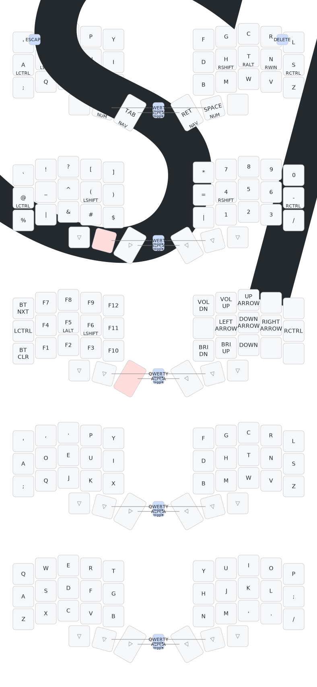

  

# Corne Choc Xiao Dvorak Layout

A Dvorak layout for the 3x5 [Corne Choc Xiao](https://github.com/JonMuller/gerbers/tree/main/corne-choc-xiao) (aka Abomination). Features:

1. Dvorak alpha layer
   - Homerow mod keys for `Ctrl` `Gui` `Alt` `Shift`
   - `Space` and `Backspace` under resting thumbkeys, `Enter` and `Tab` outwards (3rd inwards keys I don't really find necessary, have added `Del` but this could easily be chorded)
   - Chorded `Esc` on top left (relative position on traditional keyboard)
   - Ambidextrous layer shift keys for SymNum and Function layers
2. Symbols | Numpad layer
   - Related symbols paired
   - `-` `/` in same relative pinky position as on Dvorak standard layout
3. Function | DPad layer
   - F Keys 1-9 aligned as a numpad
   - Arrow keys on homerow base
   - Most common function keys (vol up/down, brightness up/down) added above/below DPad
4. Bluetoth connectivity layer
5. Dedicated Alpha-only layer for gaming where the homemod hold functions interfere with input.

